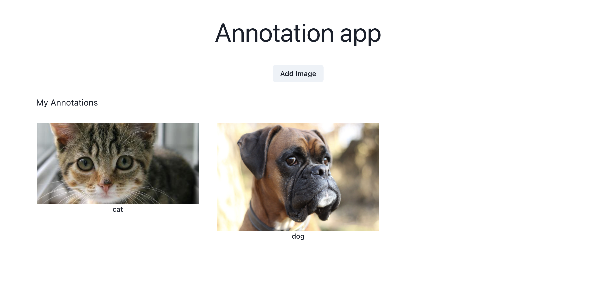
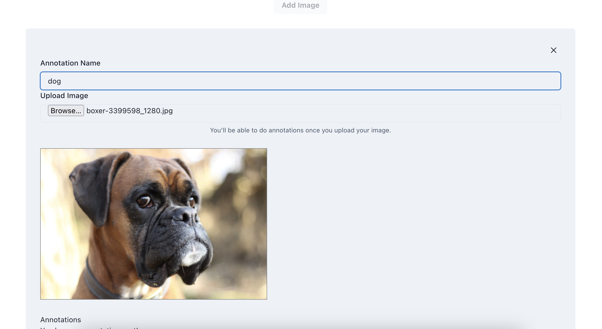
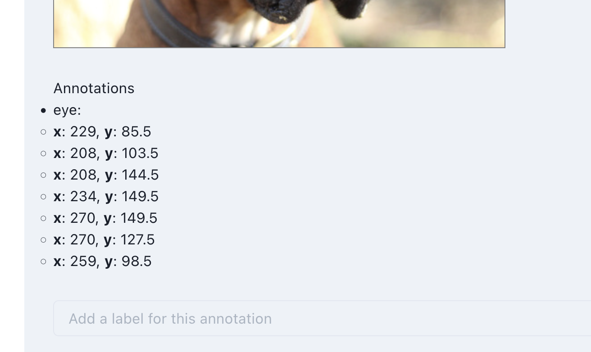
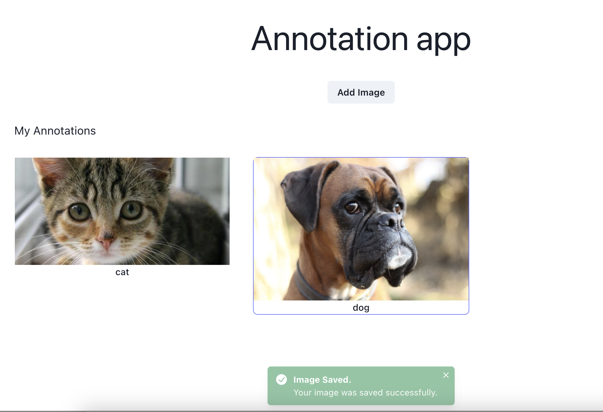
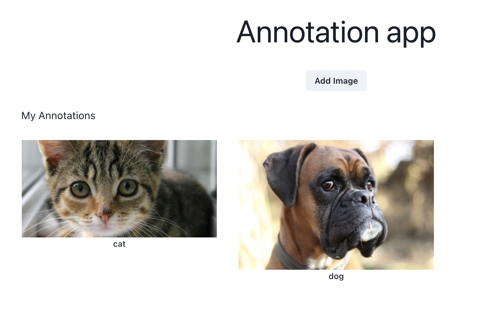

# React Annotation App

### Overview

React-based image annotation app. The idea behind of this was to dig a bit into annotations app, and after some research on various apps I wanted to create my own (and very limited) annotation app.



### Installing

```bash
npm install
```

### Running the applicacion

To run the application you'll have to run both the application and the server:

```bash
$ npm run dev
$ npm run server
```

Then you can navigate to [http://localhost:5173/](http://localhost:5173/) to access the app or [http://localhost:3000](http://localhost:3000) to see the API endpoint.

### Test the app

You can test the app by running:

```bash
npm run test
```

### Known Limitations & Considerations

- The UX can be a little buggy sometimes when we start playing around on different elements, most general scenarios were covered but there are other interactions that could cause issues.

- Lack of enough testing, I tried to add some tests but due the time lack, I put my priority on the usability of the app instead of the testability. (Added some cases but definitively are no enough)

- Backend, I decided on this iteration to go for a lightweight API server called `json-server`, this backend is ideal for POCs and testing things but is not a production-ready solution.

- Canvas & React integration, a lot of effort were done to integrate the async nature of react to the canvas operations but more can be done.

- Code Structure, I tried to keep everything as escalabe as possible, but there are things like the canvas api that could be separated to another component (or another "engine" library) to decouple hard-to-read code.

### Features

#### Create new Annotations

You can upload new images and then add your annotations with its labels:

Add features


Check points


Save and check your newly created images


once you have created the image, you can check it on the homepage:


#### Update existing Annotations

You can click any existing any existing image and edit the name, image, add new points and save the edition to see changes inmediately on the homepage.

---

@manufarfaro 2023.
